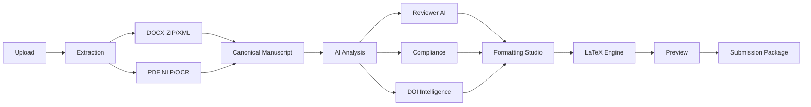

# ThaalDraft

### AI-Powered Manuscript Reconstruction & Journal Formatting Platform

ThaalDraft transforms raw research documents into publication-ready manuscripts.

Instead of only changing fonts and layouts, ThaalDraft reconstructs document structure, validates citations, performs compliance checks, reviews manuscript quality, and formats papers into journal-specific templates.

---

## Problem

Researchers frequently work with:

- Unstructured DOCX drafts
- Poorly formatted PDFs
- Missing citations and DOI metadata
- Journal-specific formatting requirements

Manual formatting is time-consuming and error-prone.

ThaalDraft automates the entire workflow.

---

## Core Features

### Reconstruction Mode

Convert raw documents into structured manuscripts.

- DOCX ZIP/XML extraction
- PDF text extraction
- Figure and table detection
- Section reconstruction
- Canonical manuscript generation

### Formatting Studio

Supported formats:

- IEEE
- Elsevier
- Custom Templates

Upcoming:

- Springer
- ACM
- Nature
- APA
- MLA

### Reviewer AI

AI-assisted manuscript evaluation:

- Writing quality analysis
- Research quality assessment
- Missing section detection
- Publication readiness review

### DOI Intelligence

Powered by:

- CrossRef
- OpenAlex
- Semantic Scholar

Features:

- DOI validation
- Metadata enrichment
- Citation verification
- Reference correction

### Compliance Engine

Checks:

- Journal requirements
- Section completeness
- Reference quality
- Formatting compliance

### Submission Package

Generate:

- Formatted Manuscript
- Reviewer Report
- Compliance Report
- DOI Report
- Cover Letter
- Conflict Statement

---

## Architecture



---

## Technology Stack

### Frontend

- Next.js 15
- TypeScript
- Tailwind CSS
- Framer Motion

### Backend

- FastAPI
- Python

### AI & NLP

- Gemini
- DeepSeek
- spaCy
- Sentence Transformers

### Citation Intelligence

- CrossRef
- OpenAlex
- Semantic Scholar

### Database

- PostgreSQL
- Supabase

### Authentication

- Firebase Authentication

### Formatting

- LaTeX
- IEEE Templates
- Elsevier Templates
- Custom Journal Templates

---

## Project Structure

```text
ThaalDraft/
│
├── frontend/
│   └── Next.js Application
│
├── backend/
│   └── FastAPI Services
│
├── docs/
│   ├── ARCHITECTURE_V2.md
│   ├── PRD_V2.md
│   ├── UI_UX_V2.md
│   └── ROADMAP_V2.md
│
└── database/
    └── DATABASE_SCHEMA_V2.sql
```

---

## Vision

Build a complete manuscript intelligence platform capable of transforming raw academic drafts into publication-ready journal submissions with minimal manual effort.
