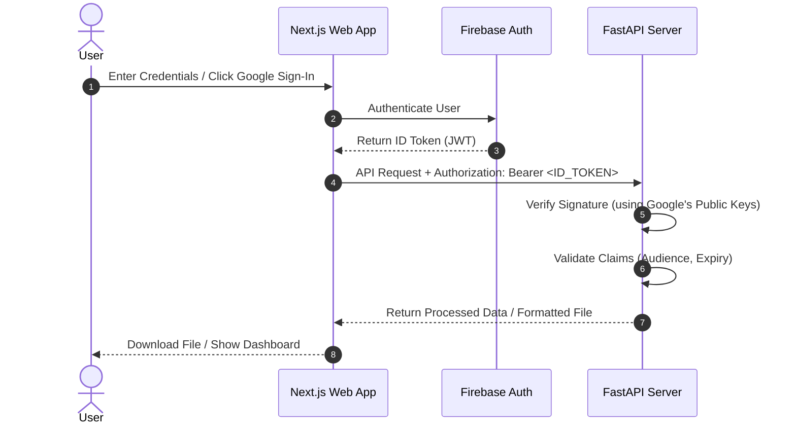

# ManuscriptAI

ManuscriptAI is an AI-powered academic document formatting application. It allows researchers and authors to instantly convert unstructured, raw DOCX manuscripts into camera-ready templates complying with major academic journals (e.g., IEEE, ACM, APA, and Nature).

This repository is split into:
- `/frontend`: A Next.js 15 web application.
- `/backend`: A FastAPI python application handling structure parsing and document formatting.

---

## 🔐 Authentication Architecture

The system uses **Firebase Authentication** for user registration, sessions, and social login (Google OAuth). 



### Key Security Features
1. **JWT Verification**: The backend verifies token signatures using Google's public certificates fetched dynamically and cached according to the certificate API's `Cache-Control` header.
2. **Client-Side Route Guarding**: Automatic redirects secure the dashboard. Anonymous users trying to hit `/dashboard` are routed to `/login`, and authenticated users trying to hit `/login` are routed back to the `/dashboard`.

---

## 🛠️ Local Setup & Configuration

### 1. Backend Configuration (`/backend`)
Create a `.env` file in the `backend/` folder based on [.env.example](file:///d:/hakathonProjks/New%20folder/backend/.env.example):
```env
FIREBASE_PROJECT_ID=your-firebase-project-id
```

> [!TIP]
> **Developer Mock Auth Mode (Fast Local Testing)**
> If `FIREBASE_PROJECT_ID` is left empty, the backend operates in **Mock Auth Mode**. It prints a warning to stdout and accepts any token starting with `mock-` (e.g. `mock-user-token`) as a valid session. This allows you to run and test the codebase locally without creating a Firebase project.

#### Steps to Run:
1. Navigate to `/backend`:
   ```bash
   cd backend
   ```
2. Activate the virtual environment:
   - Windows (PowerShell): `.\venv\Scripts\Activate.ps1`
   - macOS/Linux: `source venv/bin/activate`
3. Run the development server:
   ```bash
   uvicorn app.main:app --reload --port 8000
   ```
   The backend API will be available at `http://localhost:8000`.

---

### 2. Frontend Configuration (`/frontend`)
Create a `.env.local` file in the `frontend/` folder based on [.env.local.example](file:///d:/hakathonProjks/New%20folder/frontend/.env.local.example):
```env
NEXT_PUBLIC_FIREBASE_API_KEY=your-api-key
NEXT_PUBLIC_FIREBASE_AUTH_DOMAIN=your-project-id.firebaseapp.com
NEXT_PUBLIC_FIREBASE_PROJECT_ID=your-project-id
NEXT_PUBLIC_FIREBASE_STORAGE_BUCKET=your-project-id.appspot.com
NEXT_PUBLIC_FIREBASE_MESSAGING_SENDER_ID=your-messaging-sender-id
NEXT_PUBLIC_FIREBASE_APP_ID=your-app-id
```

#### Steps to Run:
1. Navigate to `/frontend`:
   ```bash
   cd frontend
   ```
2. Install dependencies:
   ```bash
   npm install
   ```
3. Run the development server:
   ```bash
   npm run dev
   ```
   The app will start at `http://localhost:3000`.

---

## 📦 Tech Stack Summary

### Frontend:
- **Core Framework**: Next.js 15 (using App Router)
- **Styling**: TailwindCSS, custom CSS system
- **Animations**: Framer Motion (for fluid login transitions, drag & drop states)
- **Authentication**: Firebase Client SDK

### Backend:
- **API Framework**: FastAPI (Python)
- **Document Processing**: python-docx, lxml
- **Security & Tokens**: PyJWT, cryptography
